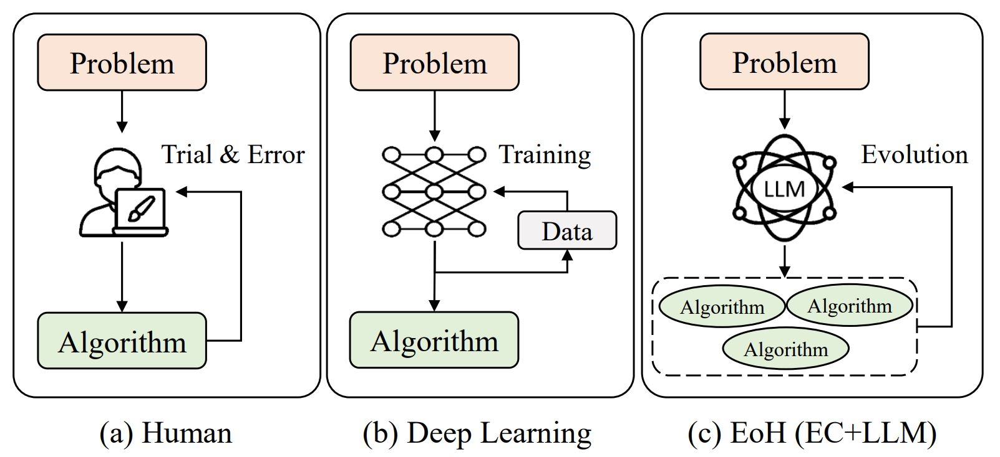

<div align=center>
<h1 align="center">
EoH: Evolution of Heuristics 
</h1>
<h3 align="center">
A Platform of Evolutionary Computation (EC) + Large Language Model (LLM) for Efficient Automatic Algorithm Design 
</h3>

</div>
<br>


A Platform for **Evolutionary Computation** + **Large Language Model** for automatic algorithm design.




## Requirements

- python >= 3.10
- numba
- numpy
- joblib


## EoH Example Usage 💻 

#### Step 1: Install EoH

We suggest install and run EoH in [conda](https://conda.io/projects/conda/en/latest/index.html) env with python>=3.10

```bash
cd eoh

pip install .
```

#### Step 2: Try Example: 

**<span style="color: red;">Setup your Endpoint and Key for remote LLM or Setup your local LLM before start !</span>** 

For example, set the llm_api_endpoint to "api.deepseek.com", set llm_api_key to "your key", and set llm_model to "deepseek-chat".

```python
from eoh import eoh
from eoh.utils.getParas import Paras

# Parameter initilization #
paras = Paras() 

# Set parameters #
paras.set_paras(method = "eoh",    # ['ael','eoh']
                problem = "bp_online", #['inventory','tsp_construct','bp_online']
                llm_api_endpoint = "xxx", # set your LLM endpoint
                llm_api_key = "xxx",   # set your LLM key
                llm_model = "gpt-3.5-turbo-1106",
                ec_pop_size = 5, # number of samples in each population
                ec_n_pop = 5,  # number of populations
                exp_n_proc = 4,  # multi-core parallel
                exp_debug_mode = False)

# initilization
evolution = eoh.EVOL(paras)

# run 
evolution.run()
```


###### Example 1: Inventory

```bash
cd examples/inventory

python runEoH.py

```
**Evaluation**
```bash
cd examples/inventory/evaluation

copy your heuristic to heuristic.py (Note that the function name/input/output must align with the evaluation block!!)

python runEval.py
```

###### Example 2: Online Bin Packing 

```bash
cd examples/bp_online

python runEoH.py
```
**Evaluation**
```bash
cd examples/bp_online/evaluation

copy your heuristic to heuristic.py (Note that the function name/input/output must align with the evaluation block!!)

python runEval.py
```


## Use EoH in Your Application

A Step-by-step guide is provided in [here](./docs/QuickGuide.md) (coming soon)


## LLMs 

1) Remote LLM + API (e.g., GPT3.5, Deepseek, Gemini Pro) (**Recommended !**):
   + OpenAI API.
   + [Deepseek API](https://platform.deepseek.com/)
   + Other APIs: 
     + https://yukonnet.site/
     + https://github.com/chatanywhere/GPT_API_free
     + https://www.api2d.com/
2) Local LLM Deployment + API (e.g., Llamacode, instruct Llama, gemma, deepseek, ...):
   + Step 1: Download Huggingface Model, for example, download gemma-2b-it (git clone https://huggingface.co/google/gemma-2b-it)
   + Step 2: 
     + cd llm_server
     + python gemma_instruct_server.py
   + Step 3: Copy your url generated by running your server to request.py ( For example, set url='http://127.0.0.1:11012/completions') to test your server deployment. 
   + Step 4: Copy your url generated by running your server to runEoH.py in your example. (For example, set url='http://127.0.0.1:11012/completions')
   + Step 5: Python runEoH.py
3) Your Implementation: 
   + If you want to use other LLM or if you want to use your own GPT API or local LLMs, please add your interface in ael/llm


## Related Works on LLM4Opt
Welcome to visit [a collection of references and research papers on LLM4Opt](https://github.com/FeiLiu36/LLM4Opt)

