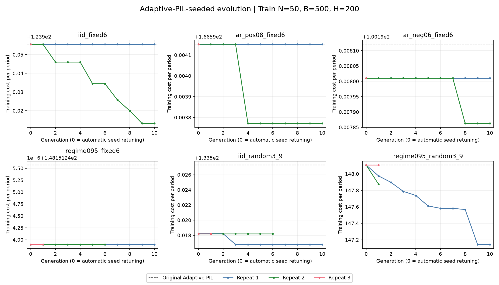

# 从 Adaptive PIL 出发的策略演化

更新时间：2026-09-16T18:02:07.413249+00:00

**训练完成 9/18 条链；测试评分完成 0/18 条链（每条需完整 8 个窗口）。主结果：尚未完成，完整比较窗口 0/48。旧起点比较：待完成。**

每个环境的三次生成全部齐全后，先在每条共同测试路径上平均三个冻结策略的成本，再与参考方法配对；未齐三次时不报告不完整均值。所有成本均为每期成本，生成样本 SD 使用 n−1 分母。95% 区间重采样完整路径，只描述路径抽样不确定性，不含生成变异，未作多重比较校正；1,000 条路径不是 1,000 次模型训练。
策略以 B=500、H=200 的训练目标优化，同一冻结规则评价四个 H；需求严格平稳，有限预热后的库存只近似稳态，冷启动单列。旧测试结果已经查看，此轮复用同一测试集作探索比较，不是新的未见留出验证。三次编号不代表两轮共用模型随机种子。

## 主结果：预热后 H=200

| 场景 | 新策略均值 | 生成 SD | Adaptive PIL 原起点 | Conditional PIL | PIL + COP | 原有上限均值（SD） | 原无上限均值（SD） |
|---|---:|---:|---:|---:|---:|---:|---:|
| exp_iid_fixed6 | — | — | 123.645 | 123.481 | 123.481 | 124.975（1.134） | — |
| exp_ar_pos08_fixed6 | — | — | 161.810 | 162.475 | 162.475 | 166.171（2.459） | — |
| exp_ar_neg06_fixed6 | — | — | 100.007 | 99.960 | 99.960 | 101.886（3.105） | — |
| exp_regime095_fixed6 | — | — | 147.733 | 150.404 | 150.404 | 152.560（2.626） | — |
| exp_iid_random3_9 | — | — | 131.992 | 132.233 | 132.733 | 139.946（5.921） | — |
| exp_regime095_random3_9 | — | — | 147.791 | 154.426 | 152.149 | 153.126（2.323） | — |

| 场景 | 参考 | 新−参考绝对差（95% CI） | 成本改善 %（95% CI） |
|---|---|---:|---:|
| exp_iid_fixed6 | Adaptive PIL（原起点） | 待完成 | — |
| exp_iid_fixed6 | Conditional PIL | 待完成 | — |
| exp_iid_fixed6 | PIL + COP | 待完成 | — |
| exp_iid_fixed6 | 原 base-stock 起点，有参数上限 | 待完成 | — |
| exp_iid_fixed6 | base-stock 起点，无参数上限 | 待完成 | — |
| exp_ar_pos08_fixed6 | Adaptive PIL（原起点） | 待完成 | — |
| exp_ar_pos08_fixed6 | Conditional PIL | 待完成 | — |
| exp_ar_pos08_fixed6 | PIL + COP | 待完成 | — |
| exp_ar_pos08_fixed6 | 原 base-stock 起点，有参数上限 | 待完成 | — |
| exp_ar_pos08_fixed6 | base-stock 起点，无参数上限 | 待完成 | — |
| exp_ar_neg06_fixed6 | Adaptive PIL（原起点） | 待完成 | — |
| exp_ar_neg06_fixed6 | Conditional PIL | 待完成 | — |
| exp_ar_neg06_fixed6 | PIL + COP | 待完成 | — |
| exp_ar_neg06_fixed6 | 原 base-stock 起点，有参数上限 | 待完成 | — |
| exp_ar_neg06_fixed6 | base-stock 起点，无参数上限 | 待完成 | — |
| exp_regime095_fixed6 | Adaptive PIL（原起点） | 待完成 | — |
| exp_regime095_fixed6 | Conditional PIL | 待完成 | — |
| exp_regime095_fixed6 | PIL + COP | 待完成 | — |
| exp_regime095_fixed6 | 原 base-stock 起点，有参数上限 | 待完成 | — |
| exp_regime095_fixed6 | base-stock 起点，无参数上限 | 待完成 | — |
| exp_iid_random3_9 | Adaptive PIL（原起点） | 待完成 | — |
| exp_iid_random3_9 | Conditional PIL | 待完成 | — |
| exp_iid_random3_9 | PIL + COP | 待完成 | — |
| exp_iid_random3_9 | 原 base-stock 起点，有参数上限 | 待完成 | — |
| exp_iid_random3_9 | base-stock 起点，无参数上限 | 待完成 | — |
| exp_regime095_random3_9 | Adaptive PIL（原起点） | 待完成 | — |
| exp_regime095_random3_9 | Conditional PIL | 待完成 | — |
| exp_regime095_random3_9 | PIL + COP | 待完成 | — |
| exp_regime095_random3_9 | 原 base-stock 起点，有参数上限 | 待完成 | — |
| exp_regime095_random3_9 | base-stock 起点，无参数上限 | 待完成 | — |

绝对差为新策略减参考，负数有利；改善百分比为正数有利。全部冷启动/预热、H=50/100/200/500 的比较见[窗口表](tables/adaptive_pil_windows.csv)和[配对差值及区间](tables/adaptive_pil_paired.csv)。

## 训练过程

曲线区分原 Adaptive PIL 的训练成本、EOH 自动优化后的 generation 0，以及随后十代的训练优胜成本。原起点取 baseline record，不能以自动优化后的 generation 0 冒充原起点；优化前后差异仅是训练结果，不保证测试改善。

| 场景 | 重复 | 原起点 | 自动优化后 g0 | 最终训练成本 | 原起点→最终训练改善 % |
|---|---:|---:|---:|---:|---:|
| exp_iid_fixed6 | 1 | 123.956 | 123.956 | 123.956 | 0.000 |
| exp_iid_fixed6 | 2 | 123.956 | 123.956 | 123.913 | 0.034 |
| exp_iid_fixed6 | 3 | 123.956 | 123.956 | — | — |
| exp_ar_pos08_fixed6 | 1 | 166.594 | 166.594 | 166.594 | 0.000 |
| exp_ar_pos08_fixed6 | 2 | 166.594 | 166.594 | 166.594 | 0.000 |
| exp_ar_pos08_fixed6 | 3 | 166.594 | 166.594 | — | — |
| exp_ar_neg06_fixed6 | 1 | 100.198 | 100.198 | 100.198 | 0.000 |
| exp_ar_neg06_fixed6 | 2 | 100.198 | 100.198 | 100.198 | 0.000 |
| exp_ar_neg06_fixed6 | 3 | 100.198 | 100.198 | — | — |
| exp_regime095_fixed6 | 1 | 148.151 | 148.151 | 148.151 | 0.000 |
| exp_regime095_fixed6 | 2 | 148.151 | 148.151 | — | — |
| exp_regime095_fixed6 | 3 | 148.151 | 148.151 | — | — |
| exp_iid_random3_9 | 1 | 133.527 | 133.518 | 133.517 | 0.008 |
| exp_iid_random3_9 | 2 | 133.527 | 133.518 | — | — |
| exp_iid_random3_9 | 3 | 133.527 | 133.518 | — | — |
| exp_regime095_random3_9 | 1 | 148.107 | 148.107 | 147.142 | 0.651 |
| exp_regime095_random3_9 | 2 | 148.107 | 148.107 | — | — |
| exp_regime095_random3_9 | 3 | 148.107 | 148.107 | — | — |

## API 费用归属

| 范围 | 请求数 | 已知费用 $ | 未决保留上限 $ | 在途预留 $ | 占用预算上界 $ |
|---|---:|---:|---:|---:|---:|
| 本 Adaptive-PIL-seed 实验 | 1130 | 1.040698 | 0.098046 | 0.039130 | 1.177874 |
| 共享账本内其他实验 | 2555 | 1.673936 | 0.060695 | 0.017349 | 1.751980 |
| 未归属／预检 | 0 | 0.000000 | 0.000000 | 0.000000 | 0.000000 |
| 共享全局（上述之和） | 3685 | 2.714634 | 0.158741 | 0.056479 | 2.929854 |

会话累计预算占用上界 = 共享全局上界 + 首轮已知与保留合计 $1.82576175（仅加入一次）= **$4.75561611**。本实验费用已经包含于共享全局，不能再加一次；未决保留不是已确认收费。

## 记录

- [机器可读状态](adaptive_pil_summary.json)
- [18 条链覆盖](tables/adaptive_pil_coverage.csv)
- [逐代训练成本](tables/adaptive_pil_training_curves.csv)
- [各轮原始指标](tables/adaptive_pil_all_results.csv)
