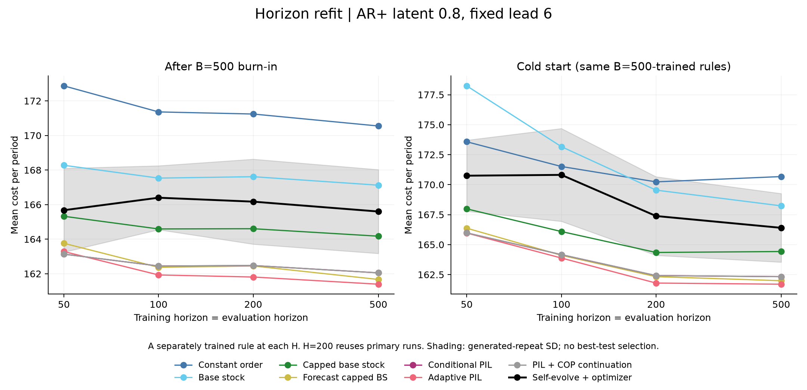

# 每个 horizon 单独重训：预注册扩展

**状态：完整。self-evolve 已完成两个初始化口径 12/12 组；基线 28/28 组。**

固定环境：正相关 Gaussian-copula 需求（latent ρ=0.8），连续指数边际均值 100，固定交货期 6，h=1、p=2。
此处每个 H=50/100/200/500 都重新优化策略，表中仅保留训练 horizon 与评价 horizon 相同的对角比较。H=200 复用主实验的三次运行与七个基线；另九次 LLM 运行属于扩展，不计入 18 个主实验分母。
这与[主报告](report.md)中固定 H=200 策略跨四种评价窗口的比较不同。所有优化仍只使用训练集；三个重复全部报告，没有按测试成本选择最好一轮。cold_start 表评价同一批按 B=500 训练的策略，从空库存开始，不表示另做冷启动目标训练。
成本单位为每期。SD 是三个独立生成重复的样本标准差，n−1 分母；基线只有一个训练拟合结果，SD 留空。有效数不足时结果为部分记录均值。独立 CSV 中的 95% 区间为单次比较的完整路径配对 bootstrap 区间，未作多重比较校正，也不包含生成变异；1,000 条测试路径不是 1,000 次独立 LLM 训练。需求严格平稳，B=500 仅使库存近似稳态；固定平稳策略的期望单位期成本不应因 H 增大而机械降低。

## 预热 500 期后的对角比较

| 训练 H = 评价 H | 方法 | 成本均值 | 生成样本 SD | 有效/计划 | 满足率 |
|---:|---|---:|---:|---:|---:|
| 50 | Constant order | 172.869 | — | 1/1 | 21.86% |
| 50 | Base stock | 168.274 | — | 1/1 | 28.65% |
| 50 | Capped base stock | 165.324 | — | 1/1 | 29.65% |
| 50 | Forecast capped BS | 163.761 | — | 1/1 | 31.98% |
| 50 | Conditional PIL | 163.134 | — | 1/1 | 30.84% |
| 50 | Adaptive PIL | 163.284 | — | 1/1 | 31.80% |
| 50 | PIL + COP continuation | 163.134 | — | 1/1 | 30.84% |
| 50 | Self-evolve + optimizer | 165.675 | 2.425 | 3/3 | 29.60% |
| 100 | Constant order | 171.362 | — | 1/1 | 23.02% |
| 100 | Base stock | 167.533 | — | 1/1 | 29.77% |
| 100 | Capped base stock | 164.591 | — | 1/1 | 30.72% |
| 100 | Forecast capped BS | 162.372 | — | 1/1 | 32.00% |
| 100 | Conditional PIL | 162.447 | — | 1/1 | 32.78% |
| 100 | Adaptive PIL | 161.930 | — | 1/1 | 32.41% |
| 100 | PIL + COP continuation | 162.447 | — | 1/1 | 32.78% |
| 100 | Self-evolve + optimizer | 166.398 | 1.850 | 3/3 | 30.61% |
| 200 | Constant order | 171.240 | — | 1/1 | 23.95% |
| 200 | Base stock | 167.614 | — | 1/1 | 29.79% |
| 200 | Capped base stock | 164.604 | — | 1/1 | 30.38% |
| 200 | Forecast capped BS | 162.450 | — | 1/1 | 30.74% |
| 200 | Conditional PIL | 162.475 | — | 1/1 | 32.42% |
| 200 | Adaptive PIL | 161.810 | — | 1/1 | 32.09% |
| 200 | PIL + COP continuation | 162.475 | — | 1/1 | 32.42% |
| 200 | Self-evolve + optimizer | 166.171 | 2.459 | 3/3 | 30.06% |
| 500 | Constant order | 170.547 | — | 1/1 | 22.90% |
| 500 | Base stock | 167.123 | — | 1/1 | 28.66% |
| 500 | Capped base stock | 164.173 | — | 1/1 | 29.75% |
| 500 | Forecast capped BS | 161.669 | — | 1/1 | 31.65% |
| 500 | Conditional PIL | 162.051 | — | 1/1 | 31.32% |
| 500 | Adaptive PIL | 161.395 | — | 1/1 | 31.39% |
| 500 | PIL + COP continuation | 162.051 | — | 1/1 | 31.32% |
| 500 | Self-evolve + optimizer | 165.600 | 2.426 | 3/3 | 29.36% |

## 冷启动对角比较

| 训练 H = 评价 H | 方法 | 成本均值 | 生成样本 SD | 有效/计划 | 满足率 |
|---:|---|---:|---:|---:|---:|
| 50 | Constant order | 173.576 | — | 1/1 | 19.13% |
| 50 | Base stock | 178.237 | — | 1/1 | 25.93% |
| 50 | Capped base stock | 167.982 | — | 1/1 | 26.37% |
| 50 | Forecast capped BS | 166.371 | — | 1/1 | 27.83% |
| 50 | Conditional PIL | 165.977 | — | 1/1 | 27.59% |
| 50 | Adaptive PIL | 165.966 | — | 1/1 | 27.73% |
| 50 | PIL + COP continuation | 165.977 | — | 1/1 | 27.59% |
| 50 | Self-evolve + optimizer | 170.747 | 2.962 | 3/3 | 27.56% |
| 100 | Constant order | 171.513 | — | 1/1 | 21.51% |
| 100 | Base stock | 173.168 | — | 1/1 | 28.30% |
| 100 | Capped base stock | 166.091 | — | 1/1 | 28.96% |
| 100 | Forecast capped BS | 164.111 | — | 1/1 | 30.01% |
| 100 | Conditional PIL | 164.163 | — | 1/1 | 31.00% |
| 100 | Adaptive PIL | 163.882 | — | 1/1 | 30.41% |
| 100 | PIL + COP continuation | 164.163 | — | 1/1 | 31.00% |
| 100 | Self-evolve + optimizer | 170.814 | 3.871 | 3/3 | 29.15% |
| 200 | Constant order | 170.232 | — | 1/1 | 23.26% |
| 200 | Base stock | 169.544 | — | 1/1 | 29.17% |
| 200 | Capped base stock | 164.346 | — | 1/1 | 29.65% |
| 200 | Forecast capped BS | 162.328 | — | 1/1 | 29.91% |
| 200 | Conditional PIL | 162.417 | — | 1/1 | 31.65% |
| 200 | Adaptive PIL | 161.794 | — | 1/1 | 31.28% |
| 200 | PIL + COP continuation | 162.417 | — | 1/1 | 31.65% |
| 200 | Self-evolve + optimizer | 167.384 | 3.278 | 3/3 | 29.51% |
| 500 | Constant order | 170.674 | — | 1/1 | 22.52% |
| 500 | Base stock | 168.232 | — | 1/1 | 28.35% |
| 500 | Capped base stock | 164.424 | — | 1/1 | 29.39% |
| 500 | Forecast capped BS | 161.991 | — | 1/1 | 31.26% |
| 500 | Conditional PIL | 162.329 | — | 1/1 | 30.97% |
| 500 | Adaptive PIL | 161.699 | — | 1/1 | 31.03% |
| 500 | PIL + COP continuation | 162.329 | — | 1/1 | 30.97% |
| 500 | Self-evolve + optimizer | 166.399 | 2.861 | 3/3 | 29.07% |

## 完整数据

- [对角比较均值与样本 SD](tables/horizon_refit.csv)
- [各生成重复与重复均值，配对相同训练 H 的全部基线](tables/horizon_refit_paired.csv)
- [含非对角交叉评价的全部原始结果](tables/all_results.csv)

该扩展只覆盖预注册的 AR+ 固定交货期环境，不能据此宣称所有需求过程都应按 horizon 重训。
