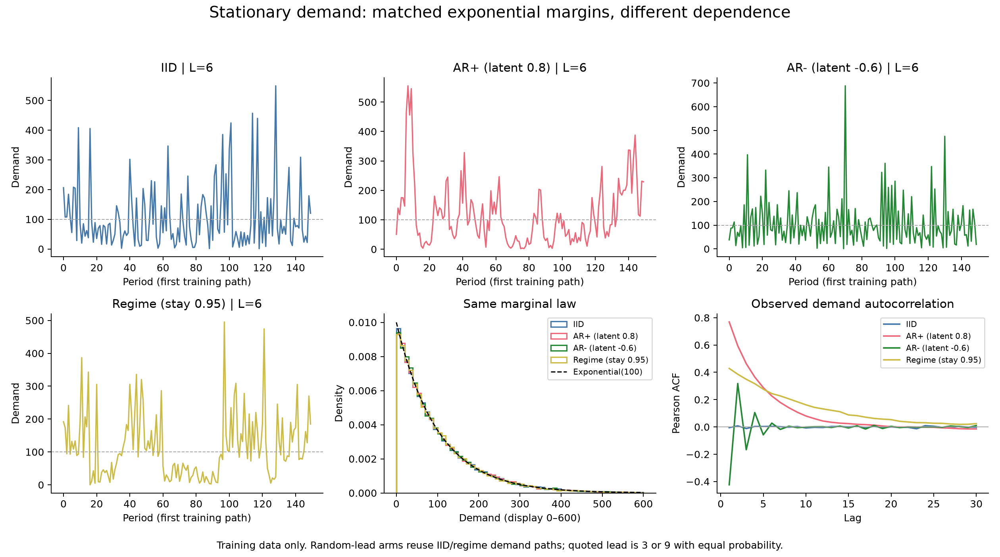
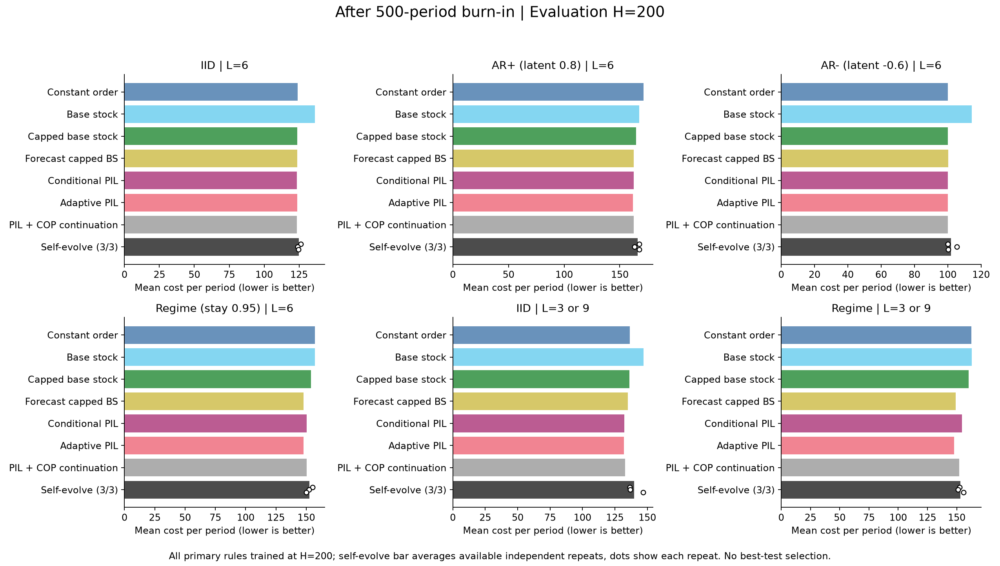
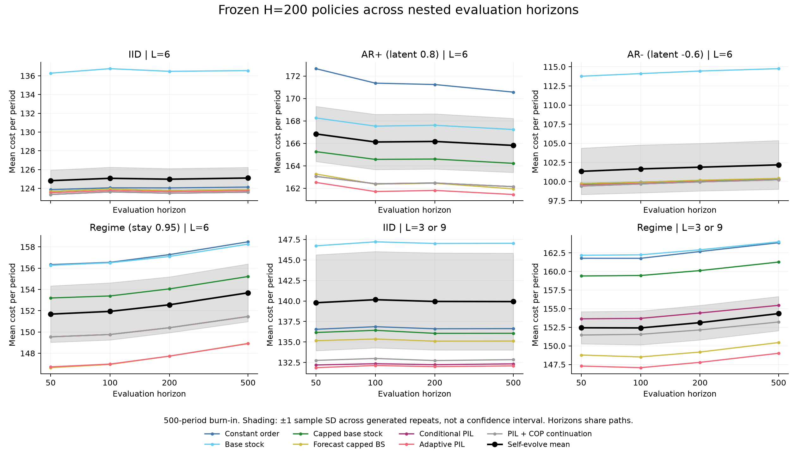
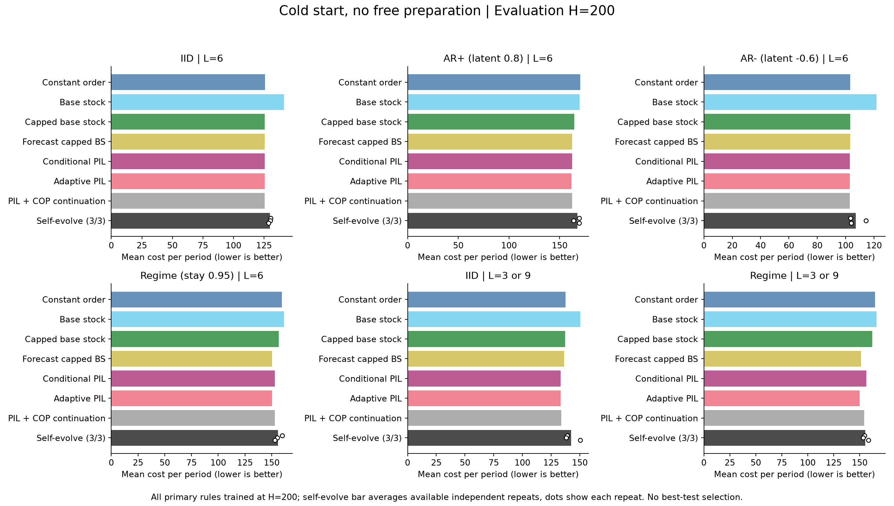

# 平稳自相关需求库存实验

更新时间：2026-09-16T08:00:42.555014+00:00

**状态：完整。主实验 H=200 已有 18/18 组；两种初始化和四个窗口全部评价 18/18 组。**
已读主实验窗口 144/144，基线窗口 336/336。pilot/非主实验行 0，另有 horizon-refit 扩展行 72；均不补足主实验分母。

## 比较口径

主策略在真实需求预热 500 期后，以 H=200 的训练成本优化；冻结同一策略评价 H=50/100/200/500。四个窗口共享同一路径前缀，不能当作独立重复。需求从不变分布初始化，严格平稳；库存仅经过 B=500 的有限预热，属于近似稳态。冷启动从空库存与空 pipeline 开始，没有免费零需求备货期，另列结果。
所有方法观察同样的上一期完整需求、当前库存、按到货日期分桶的 pipeline 与当前交货报价；不观察当前/未来需求或未来报价。随机交货期允许跨单到货。所有边际为连续 Exponential(mean=100)，潜在 AR 系数不等于需求 Pearson 自相关。
完整 self-evolve 的三个重复全部报告，不按测试成本选最好一轮；样本 SD 使用 n−1 分母。下表满足率为总销售量/总需求量。按训练成本选取的参考基线只有在七个族都完成时才用于 best-of-7 摘要，全部基线仍分别保留。
95% 区间是单次比较的完整路径配对 bootstrap 区间，未作多重比较校正，不重采样单个 period。跨重复的区间先在每条路径上平均各冻结策略成本，再重采样路径，描述这些策略的平均表现，既不是实际组合策略，也不包含生成不确定性；生成差异另以三次样本 SD 展示。1,000 条测试路径不是 1,000 次独立 LLM 训练。

## 候选有效率与费用（动态快照）

有效候选指有非空代码、源码哈希一致且训练目标有限的已落盘候选，不表示其测试表现良好；每个 slot 最多包含两次模型请求。尚未落盘的 slot 不算失败，损坏记录另列；有效率以可分类的已落盘 slot 为分母。

| 范围 | 完成/计划链 | 已落盘/计划 slot | 有效 | 无效合计 | 输出/约束无效 | 通信失败 | 未分类 | 有效率 | 已落盘 slot 的模型请求 |
|---|---:|---:|---:|---:|---:|---:|---:|---:|---:|
| 主实验 | 18/18 | 1800/1800 | 1790 | 10 | 9 | 1 | 0 | 99.4% | 1858 |
| 按 H 重训扩展 | 9/9 | 900/900 | 892 | 8 | 4 | 4 | 0 | 99.1% | 913 |
| 试运行 | 1/1 | 2/2 | 2 | 0 | 0 | 0 | 0 | 100.0% | 3 |

无效合计包括通信失败；通信失败仅依据候选中明确记录的 transport_failure 证据计数，不归为模型输出或数值约束失败。通信失败涉及的未知费用仅按 API 账本保留一次上限，恢复记录不代表费用已确认或已释放。
未完成链的候选分母仍在增长。策略接口为四个参数、Numba-compatible 的白名单数值子集，不能使用无限制 Python；模型提示没有列出完整白名单，故白名单拒绝等失败不能全部解释为模型能力不足。正式协议保持冻结，无效候选计入原搜索额度，不因结果不利而额外重抽。

API 账本包含 preflight、试运行与正式训练：已知费用 $1.781335；未决费用保留上限 $0.044427（5 请求）；正在处理的请求预留 $0.000000（0 请求）。合计占用预算上界 $1.825762，共 2775 个请求；保留上限不是已确认费用。

详见[候选逐链统计](tables/generation_quality.csv)与[完整统计及费用分类](generation_quality.json)。

## 需求诊断（仅训练集）

需求分布及相关结构在查看策略测试收益前固定；不得因为某些环境没有赢而删除。

## 主表：预热后 H=200

| 场景 | 方法 | 单位期成本 | 三次样本 SD | 有效/计划 | 满足率 |
|---|---|---:|---:|---:|---:|
| exp_iid_fixed6 | Constant order | 124.045 | — | 1/1 | 57.71% |
| exp_iid_fixed6 | Base stock | 136.474 | — | 1/1 | 51.84% |
| exp_iid_fixed6 | Capped base stock | 123.753 | — | 1/1 | 58.10% |
| exp_iid_fixed6 | Forecast capped BS | 123.755 | — | 1/1 | 58.11% |
| exp_iid_fixed6 | Conditional PIL | 123.481 | — | 1/1 | 57.86% |
| exp_iid_fixed6 | Adaptive PIL | 123.645 | — | 1/1 | 58.17% |
| exp_iid_fixed6 | PIL + COP continuation | 123.481 | — | 1/1 | 57.86% |
| exp_iid_fixed6 | self-evolve + optimizer | 124.975 | 1.134 | 3/3 | 56.24% |
| exp_ar_pos08_fixed6 | Constant order | 171.240 | — | 1/1 | 23.95% |
| exp_ar_pos08_fixed6 | Base stock | 167.614 | — | 1/1 | 29.79% |
| exp_ar_pos08_fixed6 | Capped base stock | 164.604 | — | 1/1 | 30.38% |
| exp_ar_pos08_fixed6 | Forecast capped BS | 162.450 | — | 1/1 | 30.74% |
| exp_ar_pos08_fixed6 | Conditional PIL | 162.475 | — | 1/1 | 32.42% |
| exp_ar_pos08_fixed6 | Adaptive PIL | 161.810 | — | 1/1 | 32.09% |
| exp_ar_pos08_fixed6 | PIL + COP continuation | 162.475 | — | 1/1 | 32.42% |
| exp_ar_pos08_fixed6 | self-evolve + optimizer | 166.171 | 2.459 | 3/3 | 30.06% |
| exp_ar_neg06_fixed6 | Constant order | 100.167 | — | 1/1 | 67.19% |
| exp_ar_neg06_fixed6 | Base stock | 114.450 | — | 1/1 | 62.42% |
| exp_ar_neg06_fixed6 | Capped base stock | 100.083 | — | 1/1 | 67.67% |
| exp_ar_neg06_fixed6 | Forecast capped BS | 100.188 | — | 1/1 | 67.47% |
| exp_ar_neg06_fixed6 | Conditional PIL | 99.960 | — | 1/1 | 67.52% |
| exp_ar_neg06_fixed6 | Adaptive PIL | 100.007 | — | 1/1 | 67.57% |
| exp_ar_neg06_fixed6 | PIL + COP continuation | 99.960 | — | 1/1 | 67.52% |
| exp_ar_neg06_fixed6 | self-evolve + optimizer | 101.886 | 3.105 | 3/3 | 66.73% |
| exp_regime095_fixed6 | Constant order | 157.278 | — | 1/1 | 25.97% |
| exp_regime095_fixed6 | Base stock | 157.103 | — | 1/1 | 29.50% |
| exp_regime095_fixed6 | Capped base stock | 154.055 | — | 1/1 | 29.00% |
| exp_regime095_fixed6 | Forecast capped BS | 147.737 | — | 1/1 | 36.45% |
| exp_regime095_fixed6 | Conditional PIL | 150.404 | — | 1/1 | 34.10% |
| exp_regime095_fixed6 | Adaptive PIL | 147.733 | — | 1/1 | 37.52% |
| exp_regime095_fixed6 | PIL + COP continuation | 150.404 | — | 1/1 | 34.10% |
| exp_regime095_fixed6 | self-evolve + optimizer | 152.560 | 2.626 | 3/3 | 35.12% |
| exp_iid_random3_9 | Constant order | 136.612 | — | 1/1 | 50.27% |
| exp_iid_random3_9 | Base stock | 147.019 | — | 1/1 | 47.36% |
| exp_iid_random3_9 | Capped base stock | 136.055 | — | 1/1 | 50.74% |
| exp_iid_random3_9 | Forecast capped BS | 135.104 | — | 1/1 | 51.83% |
| exp_iid_random3_9 | Conditional PIL | 132.233 | — | 1/1 | 53.73% |
| exp_iid_random3_9 | Adaptive PIL | 131.992 | — | 1/1 | 53.99% |
| exp_iid_random3_9 | PIL + COP continuation | 132.733 | — | 1/1 | 53.71% |
| exp_iid_random3_9 | self-evolve + optimizer | 139.946 | 5.921 | 3/3 | 49.65% |
| exp_regime095_random3_9 | Constant order | 162.685 | — | 1/1 | 24.52% |
| exp_regime095_random3_9 | Base stock | 162.921 | — | 1/1 | 28.24% |
| exp_regime095_random3_9 | Capped base stock | 160.125 | — | 1/1 | 27.85% |
| exp_regime095_random3_9 | Forecast capped BS | 149.175 | — | 1/1 | 36.07% |
| exp_regime095_random3_9 | Conditional PIL | 154.426 | — | 1/1 | 32.52% |
| exp_regime095_random3_9 | Adaptive PIL | 147.791 | — | 1/1 | 38.30% |
| exp_regime095_random3_9 | PIL + COP continuation | 152.149 | — | 1/1 | 34.97% |
| exp_regime095_random3_9 | self-evolve + optimizer | 153.126 | 2.323 | 3/3 | 35.48% |

## 四个评价窗口

曲线阴影为已完成生成重复之间的 ±1 样本 SD，不是路径抽样 CI。缺失重复不补值。若库存和需求都恰处稳态，stationary 策略的期望单位期成本不因 H 改变；有限样本和近似预热会造成曲线差异。

另见[每个 horizon 单独重训的预注册扩展](horizon_refit.md)：仅 AR+ 固定交货期，训练 H=评价 H 的对角比较；扩展与本节固定策略的跨时域评价分开报告。

## 冷启动：H=200（独立口径）

| 场景 | 方法 | 单位期成本 | 三次样本 SD | 有效/计划 | 满足率 |
|---|---|---:|---:|---:|---:|
| exp_iid_fixed6 | Constant order | 125.828 | — | 1/1 | 55.80% |
| exp_iid_fixed6 | Base stock | 141.296 | — | 1/1 | 50.58% |
| exp_iid_fixed6 | Capped base stock | 125.636 | — | 1/1 | 56.25% |
| exp_iid_fixed6 | Forecast capped BS | 125.638 | — | 1/1 | 56.26% |
| exp_iid_fixed6 | Conditional PIL | 125.457 | — | 1/1 | 56.21% |
| exp_iid_fixed6 | Adaptive PIL | 125.537 | — | 1/1 | 56.34% |
| exp_iid_fixed6 | PIL + COP continuation | 125.457 | — | 1/1 | 56.21% |
| exp_iid_fixed6 | self-evolve + optimizer | 129.787 | 0.837 | 3/3 | 55.44% |
| exp_ar_pos08_fixed6 | Constant order | 170.232 | — | 1/1 | 23.26% |
| exp_ar_pos08_fixed6 | Base stock | 169.544 | — | 1/1 | 29.17% |
| exp_ar_pos08_fixed6 | Capped base stock | 164.346 | — | 1/1 | 29.65% |
| exp_ar_pos08_fixed6 | Forecast capped BS | 162.328 | — | 1/1 | 29.91% |
| exp_ar_pos08_fixed6 | Conditional PIL | 162.417 | — | 1/1 | 31.65% |
| exp_ar_pos08_fixed6 | Adaptive PIL | 161.794 | — | 1/1 | 31.28% |
| exp_ar_pos08_fixed6 | PIL + COP continuation | 162.417 | — | 1/1 | 31.65% |
| exp_ar_pos08_fixed6 | self-evolve + optimizer | 167.384 | 3.278 | 3/3 | 29.51% |
| exp_ar_neg06_fixed6 | Constant order | 103.114 | — | 1/1 | 65.00% |
| exp_ar_neg06_fixed6 | Base stock | 121.706 | — | 1/1 | 60.75% |
| exp_ar_neg06_fixed6 | Capped base stock | 103.084 | — | 1/1 | 65.49% |
| exp_ar_neg06_fixed6 | Forecast capped BS | 103.180 | — | 1/1 | 65.31% |
| exp_ar_neg06_fixed6 | Conditional PIL | 102.996 | — | 1/1 | 65.49% |
| exp_ar_neg06_fixed6 | Adaptive PIL | 102.999 | — | 1/1 | 65.47% |
| exp_ar_neg06_fixed6 | PIL + COP continuation | 102.996 | — | 1/1 | 65.49% |
| exp_ar_neg06_fixed6 | self-evolve + optimizer | 107.240 | 6.137 | 3/3 | 65.07% |
| exp_regime095_fixed6 | Constant order | 159.426 | — | 1/1 | 24.95% |
| exp_regime095_fixed6 | Base stock | 161.394 | — | 1/1 | 28.57% |
| exp_regime095_fixed6 | Capped base stock | 156.474 | — | 1/1 | 27.96% |
| exp_regime095_fixed6 | Forecast capped BS | 150.454 | — | 1/1 | 35.20% |
| exp_regime095_fixed6 | Conditional PIL | 152.822 | — | 1/1 | 32.96% |
| exp_regime095_fixed6 | Adaptive PIL | 150.430 | — | 1/1 | 36.35% |
| exp_regime095_fixed6 | PIL + COP continuation | 152.822 | — | 1/1 | 32.96% |
| exp_regime095_fixed6 | self-evolve + optimizer | 156.029 | 3.544 | 3/3 | 34.16% |
| exp_iid_random3_9 | Constant order | 137.643 | — | 1/1 | 48.61% |
| exp_iid_random3_9 | Base stock | 150.279 | — | 1/1 | 46.54% |
| exp_iid_random3_9 | Capped base stock | 137.124 | — | 1/1 | 49.39% |
| exp_iid_random3_9 | Forecast capped BS | 136.288 | — | 1/1 | 50.41% |
| exp_iid_random3_9 | Conditional PIL | 133.341 | — | 1/1 | 52.59% |
| exp_iid_random3_9 | Adaptive PIL | 133.125 | — | 1/1 | 52.72% |
| exp_iid_random3_9 | PIL + COP continuation | 133.893 | — | 1/1 | 52.69% |
| exp_iid_random3_9 | self-evolve + optimizer | 142.442 | 6.780 | 3/3 | 49.01% |
| exp_regime095_random3_9 | Constant order | 164.713 | — | 1/1 | 23.53% |
| exp_regime095_random3_9 | Base stock | 166.117 | — | 1/1 | 27.52% |
| exp_regime095_random3_9 | Capped base stock | 162.109 | — | 1/1 | 26.99% |
| exp_regime095_random3_9 | Forecast capped BS | 151.425 | — | 1/1 | 34.83% |
| exp_regime095_random3_9 | Conditional PIL | 156.323 | — | 1/1 | 31.57% |
| exp_regime095_random3_9 | Adaptive PIL | 149.950 | — | 1/1 | 37.13% |
| exp_regime095_random3_9 | PIL + COP continuation | 154.204 | — | 1/1 | 34.04% |
| exp_regime095_random3_9 | self-evolve + optimizer | 155.367 | 2.560 | 3/3 | 34.62% |

## 完整结果与核查

- [全部策略与逐重复指标](tables/all_results.csv)
- [三次生成均值与样本 SD](tables/repeats.csv)
- [各重复及重复均值的逐基线配对比较](tables/paired.csv)
- [18 个主实验组覆盖情况](tables/coverage.csv)
- [按训练成本选择的基线](tables/best_training_baselines.csv)
- [主表与完整训练选定参考的比较](tables/main_vs_best_training_baseline.csv)
- [可机读状态及检查问题](analysis_summary.json)

PIL 为投影库存水平策略的数值适配。随机交货期下 committed-only 与 COP continuation 的投影假设不同，不能视为同一个精确策略；本实验不声称最优性证明。
